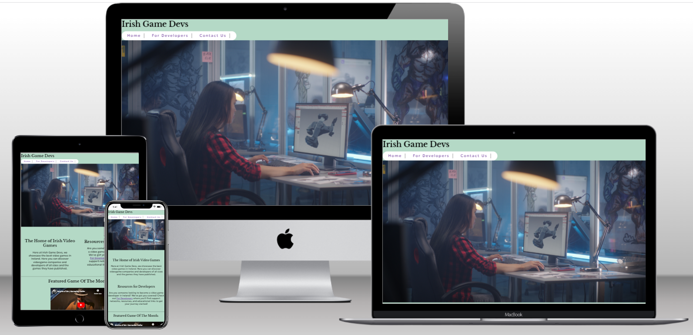
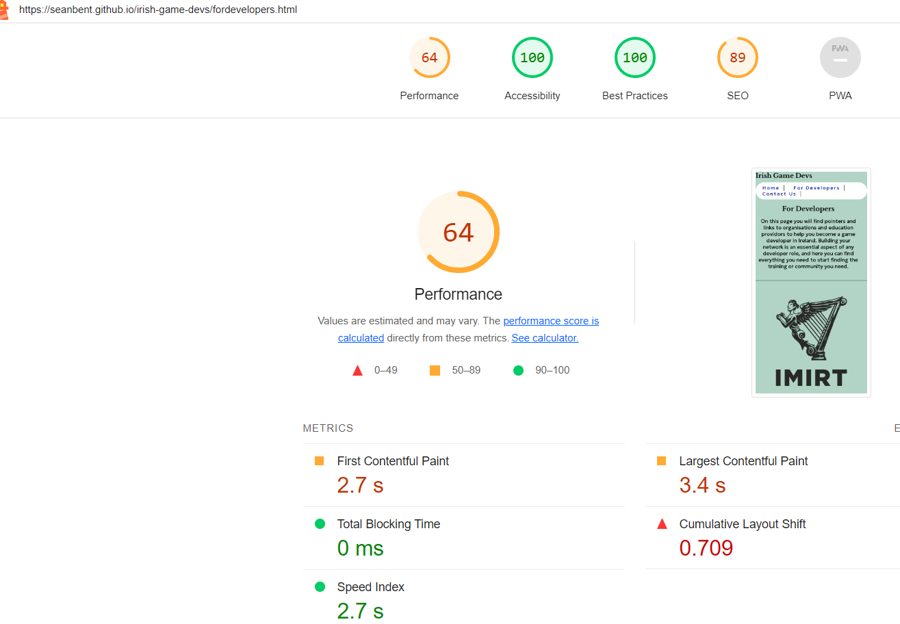

<h1>Irish Game Devs </h1>

<h2>Introduction</h2>
Irish Game Devs is a website that showcases video games created by individuals or game studios in Ireland. It aims to celebrate the talent present in Ireland as well as the creations they have made. This website has also been created in the hopes of encourging new people to become game devs by providing pointers to the organisations and resources available to support them, as well as eduational opportunities in game dev. A means of getting one's own game featured n the site is also present through the contact form.

<h3>The target audiences are:</h3>
-Video game enthusiasts of Ireland and the rest of the world who are interested in Irish-made games and game development in Ireland.

-Indie, mid, and large video game developers in Ireland.

-People interested in becoming game developers in Ireland.

By answering questions such as “What video games have been made in Ireland?”, “What level of quality can be found in games produced in Ireland?" and "How do I become a developer in Ireland?" it is hoped that the site will encourage greater participation in the Irish video game development landscape.

<h2>Features:</h2>

1. <h3>Site-wide:</h3>

   Navigation bar that includes links to the Home page, For Developers page, and Contact Us page:
   
   

   
   -Footer containing social media links:

   
   

2. <h3>The 'Home' page:</h3>
   -A hero image demonstrating a person doing active game development:

   

   -An explanation of what the site as and what it intends to achieve.
   
   -A section of text that highlights that the site contains resources available to help people to become game developers, and a link to the 'For Developers' page:

   

   -A featured game of the month section including a youtube video and description of the game, as well as links to websites for the game and the studio:
   
   

   
   -A 'Recent Releases' section showing recently released Irish games, youtube videos of the games, as well as links to websites for the games and the studios:

   

   
   -A 'Get your game featured' section pointing users to the Contact Us page where they can fill in a form:

   
   
   
   
3. <h3>'For Developers' page:</h3>

   -Images relating to Imirt and Pulse college, text explaining Imirt and Pulse College and their use to prospective developers, and links to Imirt and Pulse College Websites.

   

   

   
   
4. <h3>'Contact Us' page:</h3>

   -Form to fill in that can be used by developers to contact the website to get their game featured
   
   -Text explaning the form.
   
   -A background image.

   

5. <h3>'Thank You' page:</h3>
   
   -A page that appears when a user has subitted the form, thanking them for interacting with the site.

   
   

<h2>Features Left to Implement:</h2>

1. Fully responsive navbar. 
   
2. Fully responsive hero image at higher screen widths
   
3. Styled Submit button on form
   
4. A more comprehensive list of games
   
5. A search bar to search for content by studio, title, and release year.

6.  Profile pages for developers.

<h2>Testing</h2>
After some initial code and structure was laid out, the approach for development became a 'mobile first' approach. As content was added and tests conducted, 280px screen width was the starting break point, with subsequent breakpoints being 380px, 440px, 560px, 760px. As screen width increased, many problems began to present themselves and had to be troublshooted. Of particular issue was the fact that many of the stylings were defined in absolute values. This led to overflows and compression of text, as well as sections being stuck on the left of the screen.

Later, the majority of the containers and stylings were swapped over to flex values, allowing more robust placement and elimination of overflows after much testing to find the correct values.

The deployed website was viewed and tested on Chrome, Edge, and Firefox. No notable difference in appearance or performance or functionaity was observed. 

<h3>Feature Testing</h3>

-Navbar links tests involved clicking on each navbar link in turn on each page, to verify that they correctly redirect the user to the specified page.

-To verify videos displayed and played without loss of aspect ratio or areas being cutoff from viewing involved observing the embedded video, then clicking play on each. Then clicking the fullscreen button to verify the video will display fullscreen.

-To verify the form validation worked, each field would be filled out in turn and then 'Submit' would be clicked. If any field was left blank, the validation message should appear.

<h3>Responsivity Testing</h3>

To test responsivity, devtools would be opened and the screen size adjusted either by selecting a specific device's dimensions, or by dragging the sides to adjust the width or height. Then observations were made about the effect the change had on each part of the page. Then css wwould be adjusted to achieve the necessary changes to achieve responsivity.

<h3>Validator Testing</h2>

HTML: No errors were returned when passing through the official W3C validator.

CSS: No errors were found when passing through the official (Jigsaw) validator.

<h3>Performance Testing</h3>

A performance test was run using google lighthouse:

While the index page scored high on accessibility, best pratices and SEO, it did poorly in Performance, seemingly due to the image. If more time were available, this would be looked at and ways found to imprve performance. It was a similar story for the other pages:

<h2>Unfixed Bugs</h2>

1. Navbar responsivity: while in general the site scales better at lower screen sizes, the navbar suffers a very noticable distortion of shape at lower screen widths. At first this was judged an issue that would be addressed later in the project as it was otherwise fully functional, and as more content was added and needed fixing, this feature kept getting put off. Then, with little time remaining the focus needed to turn to larger structural issues and completing the README.
   
   
   
   
   
2. Hero Image: at lower to mid size screens the hero image on index.html scales well. But on higher screen sizes it is overwhelmingly large and breaks the natural flow of the page. With more time to fix this, a likely solution would be to display a cropped image instead at higher breakpoints.

   
3. Entire area above the navbar is clickable and leads to home page. This is likely due to the block element of the logo extending the entire width of the page.

<h2>Deployment</h2>

1. Navigate to settings in the GitHub Repository

2. Select 'Pages' on the left

3. Select 'Main' in the dropdown menu under 'Branch'

4. Click 'Save'

5. Refresh page and copy link to deployed site. The link to the deployed site of Irish Game Devs is: https://seanbent.github.io/irish-game-devs/
   
   
   

<h2>Credits</h2>

<h3>Content</h3>

The paragraph about Empire of Sin was based on information from the Romero Games website (<https://romerogames.com/>) and the Paradox Interactive website (<https://www.paradoxinteractive.com/games/empire-of-sin/about>)

The paragraph about The Pale Beyond was based on information from its Steam page (<https://store.steampowered.com/app/1266030/The_Pale_Beyond/>) and the Bellular Games website: <https://bellular.games/>

The paragraph about Imirt was copied directly from the Imirt website: <https://www.imirt.ie/faq>

The paragraph about Pulse College was based on an exploration of the information on the Pulse College Website: https://www.pulsecollege.com/

<h3>Code</h3>

The information about flexbox that was critical to this website came from: <https://css-tricks.com/snippets/css/a-guide-to-flexbox/>

The code for the translucent effect of the Form came directly from the Love Running walkthrough on Codeinstitute.

The information used to write media queries came from: <https://css-tricks.com/a-complete-guide-to-css-media-queries/>

The majority of the code used to build this website came from lessons in the HTML and CSS modules on Codeinstitute.

The information on deployment used in this document came from the Deployment Essentials module on Codeinstitute though some alterations had to be made as the website is laid out slightly different now. 

<h3>Media</h3>

The gameplay trailer for Empire of Sin was taken from the Paradox Interactive Youtube channel: <https://www.youtube.com/watch?v=F_izLa5D5NY&t=6s>

The gameplay trailer for The Pale Beyond was taken from the Fellow Traveller Youtube channel: <https://www.youtube.com/watch?v=AmhSEQDrkAo>

The Imirt image was taken from the Imirt website: <https://www.imirt.ie/>

The Pulse college banner was taken from <https://www.pulsecollege.com/>

The Hero Image named developer.jpg on Irish Game Devs was taken from <https://stock.adobe.com/>

The background image named laptopandpad.jpeg on Irish Game Devs was taken from <https://unsplash.com/>

The footer social media icons came from fontawesome

